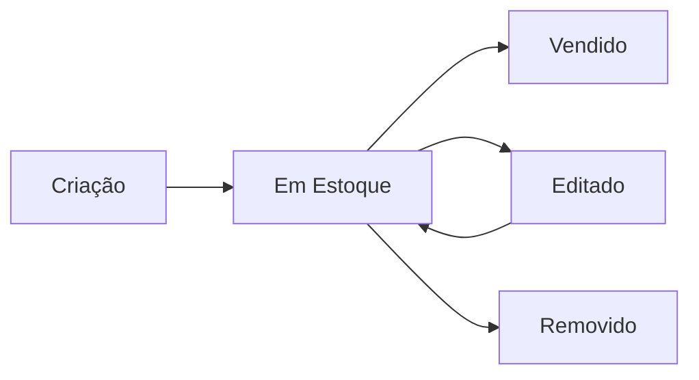

# 📋 Especificação da API Backend - Util Lar

## 📌 Visão Geral

Este documento descreve a API REST necessária para integração completa do frontend Angular com o backend. O sistema gerencia produtos (móveis e eletros novos e seminovos) com foco em vendas e gestão financeira.

---

## 🔐 Autenticação

### Sistema de Admin

O frontend possui um sistema de **modo admin** ativado por **triple-click no logo** com senha fixa:
- **Password**: `utillar2026`
- **Armazenamento**: LocalStorage (`adminMode: 'true'`)
- **Duração**: Indefinida (até logout manual)

**Nota**: Atualmente não há sistema de login com backend. O modo admin é apenas frontend. Se desejar implementar autenticação real:

#### Endpoint Sugerido (Opcional)
```
POST /api/auth/admin/login
```

**Request Body**:
```json
{
  "password": "string"
}
```

**Response 200**:
```json
{
  "success": true,
  "token": "jwt-token-here",
  "expiresAt": "2026-02-28T23:59:59Z"
}
```

---

## 📦 Modelo de Dados: Produto

### Interface TypeScript (Product)

```typescript
interface Product {
  id: number;                    // ID único (auto-incremento)
  name: string;                  // Nome do produto
  slug: string;                  // URL-friendly (gerado do name)
  description: string;           // Descrição completa
  price: number;                 // ⚠️ PREÇO EM CENTAVOS (ex: 50000 = R$ 500,00)
  costPrice?: number;            // ⚠️ CUSTO EM CENTAVOS (opcional, para admin)
  condition: 'novo' | 'seminovo';   // Condição do produto
  category: string;              // Categoria (ex: 'Sofá', 'Mesa', 'Cadeira')
  images: string[] | null;       // Array de URLs de imagens
  stock: number;                 // Quantidade em estoque
  dimensions?: {                 // Dimensões opcionais
    width: number;
    height: number;
    depth: number;
    unit: 'cm' | 'm';
  };
  material?: string;             // Ex: 'madeira', 'metal', 'tecido'
  color?: string;                // Cor do produto
  brand?: string;                // Marca
  warranty?: string;             // Ex: '90 dias', '6 meses', '1 ano'
  featured: boolean;             // Produto em destaque
  soldDate?: string;             // ISO 8601 - Data da venda (null se não vendido)
  createdAt: string;             // ISO 8601 - Data de criação
  updatedAt: string;             // ISO 8601 - Última atualização
}
```

### ⚠️ IMPORTANTE: Formato de Preços

**Todos os preços são armazenados em CENTAVOS** para evitar problemas de precisão com decimais:

```
R$ 1.899,00  →  price: 189900
R$ 459,50    →  price: 45950
R$ 10.000,00 →  price: 1000000
```

**Conversão**:
- **Backend → Frontend**: Já em centavos (nenhuma conversão necessária)
- **Frontend → Display**: `(price / 100).toFixed(2).replace('.', ',')`

---

## 🛣️ Endpoints da API

### Base URL
```
http://localhost:3000/api
```

---

### 1. Listar Todos os Produtos

```
GET /api/products
```

**Query Parameters** (opcional):
```
?category=Sofá           // Filtrar por categoria
?condition=novo          // Filtrar por condição
?featured=true           // Apenas produtos em destaque
?soldDate=null           // Apenas produtos não vendidos
```

**Response 200**:
```json
[
  {
    "id": 1,
    "name": "Sofá 3 Lugares Retrátil Cinza",
    "slug": "sofa-3-lugares-retratil-cinza",
    "description": "Sofá confortável de 3 lugares com mecanismo retrátil...",
    "price": 189900,
    "costPrice": 130000,
    "condition": "novo",
    "category": "Sofá",
    "images": [
      "https://example.com/image1.jpg",
      "https://example.com/image2.jpg"
    ],
    "stock": 5,
    "dimensions": {
      "width": 220,
      "height": 85,
      "depth": 95,
      "unit": "cm"
    },
    "material": "Tecido e Espuma",
    "color": "Cinza",
    "brand": "Util Lar",
    "warranty": "90 dias",
    "featured": true,
    "soldDate": null,
    "createdAt": "2026-02-01T10:30:00Z",
    "updatedAt": "2026-02-01T10:30:00Z"
  }
]
```

---

### 2. Buscar Produto por ID

```
GET /api/products/:id
```

**Response 200**:
```json
{
  "id": 1,
  "name": "Sofá 3 Lugares Retrátil Cinza",
  // ... todos os campos do produto
}
```

**Response 404**:
```json
{
  "error": "Produto não encontrado",
  "statusCode": 404
}
```

---

### 3. Criar Novo Produto

```
POST /api/products
```

**Request Body**:
```json
{
  "name": "Mesa de Jantar 6 Lugares",
  "description": "Mesa em madeira maciça...",
  "price": 129900,
  "costPrice": 85000,
  "condition": "novo",
  "category": "Mesa",
  "images": [
    "https://example.com/mesa1.jpg",
    "https://example.com/mesa2.jpg"
  ],
  "stock": 3,
  "dimensions": {
    "width": 160,
    "height": 75,
    "depth": 90,
    "unit": "cm"
  },
  "material": "Madeira Maciça",
  "color": "Marrom",
  "brand": "Mobília Prime",
  "warranty": "6 meses",
  "featured": false
}
```

**Response 201**:
```json
{
  "id": 6,
  "name": "Mesa de Jantar 6 Lugares",
  "slug": "mesa-de-jantar-6-lugares",
  // ... todos os campos
  "createdAt": "2026-02-28T14:00:00Z",
  "updatedAt": "2026-02-28T14:00:00Z"
}
```

**Regras de Negócio**:
- `slug` deve ser gerado automaticamente a partir do `name`:
  - Converter para minúsculas
  - Remover acentos
  - Substituir espaços por hífens
  - Remover caracteres especiais
  - Exemplo: `"Sofá 3 Lugares"` → `"sofa-3-lugares"`
- `createdAt` e `updatedAt` devem ser gerados automaticamente
- `soldDate` deve ser `null` por padrão

---

### 4. Atualizar Produto

```
PUT /api/products/:id
PATCH /api/products/:id  (atualização parcial)
```

**Request Body** (parcial permitido):
```json
{
  "price": 159900,
  "stock": 8,
  "featured": true
}
```

**Response 200**:
```json
{
  "id": 1,
  // ... produto atualizado com novo updatedAt
  "updatedAt": "2026-02-28T14:30:00Z"
}
```

**Regras**:
- `updatedAt` deve ser atualizado automaticamente
- Se `name` for alterado, `slug` deve ser regenerado

---

### 5. Remover Produto

```
DELETE /api/products/:id
```

**Response 200**:
```json
{
  "message": "Produto removido com sucesso",
  "id": 1
}
```

**Response 404**:
```json
{
  "error": "Produto não encontrado",
  "statusCode": 404
}
```

---

### 6. Marcar Produto como Vendido

```
POST /api/products/:id/sold
```

**Request Body** (opcional):
```json
{
  "soldDate": "2026-02-28T15:00:00Z"  // Se não fornecido, usar data/hora atual
}
```

**Response 200**:
```json
{
  "id": 1,
  "name": "Sofá 3 Lugares",
  "stock": 0,
  "soldDate": "2026-02-28T15:00:00Z",
  "updatedAt": "2026-02-28T15:00:00Z"
}
```

**Regras de Negócio**:
- Deve definir `soldDate` com timestamp atual (se não fornecido)
- Deve definir `stock` como `0`
- Deve atualizar `updatedAt`
- Produto vendido ainda fica no banco (não é deletado)

---

## 📊 Dashboard Financeiro

O frontend calcula métricas financeiras em tempo real. Para otimizar, o backend pode fornecer um endpoint agregado:

### Endpoint de Estatísticas (Opcional mas Recomendado)

```
GET /api/products/statistics
```

**Response 200**:
```json
{
  "currentMonth": {
    "profit": 250000,        // Lucro do mês atual em centavos
    "itemsSold": 12,
    "totalRevenue": 450000,
    "averageTicket": 37500,
    "topProduct": "Sofá 3 Lugares"
  },
  "lastMonth": {
    "profit": 180000,
    "itemsSold": 8
  },
  "overall": {
    "totalProfit": 1250000,
    "totalRevenue": 2400000,
    "averageMargin": 35.5
  },
  "stock": {
    "totalItems": 23,
    "totalValue": 980000,        // Valor investido em estoque
    "potentialValue": 1520000,   // Valor de venda do estoque
    "potentialProfit": 540000,   // Lucro potencial
    "oldStockCount": 3           // Produtos com >60 dias
  },
  "topProducts": [
    {
      "name": "Sofá 3 Lugares",
      "revenue": 380000,
      "timesSold": 2
    }
  ],
  "lowMarginProducts": [
    {
      "name": "Mesa de Centro",
      "margin": 12.5,
      "price": 45000,
      "costPrice": 39500
    }
  ]
}
```

**Se não implementar este endpoint**, o frontend irá:
1. Buscar todos os produtos via `GET /api/products`
2. Calcular todas as métricas no lado do cliente
3. **Performance**: Funciona, mas mais lento com muitos produtos

---

## 🗂️ Categorias do Sistema

O sistema usa as seguintes categorias (string livre, mas padronização sugerida):

- `Sofá`
- `Mesa`
- `Cadeira`
- `Guarda-Roupa` (ou `Armário`)
- `Rack`
- `Eletrodoméstico` (ou `Eletros`)
- `Cama`
- `Cômoda`
- Outras conforme necessário

**Filtros do frontend**: O sistema filtra por estas categorias exatas (case-sensitive).

---

## 🔄 Fluxo de Dados Completo

### Ciclo de Vida do Produto



1. **Criação**: `POST /api/products` → Produto criado com `soldDate = null`
2. **Listagem**: Frontend busca via `GET /api/products`
3. **Filtros**: Frontend aplica filtros por categoria
4. **Edição**: Admin edita via `PUT /api/products/:id`
5. **Venda**: Admin marca como vendido via `POST /api/products/:id/sold`
6. **Remoção**: Admin remove via `DELETE /api/products/:id`

---

## 🎨 Upload de Imagens

### Estratégia Recomendada

O campo `images` é um array de URLs. O backend deve:

**Opção 1: Upload para Servidor**
```
POST /api/upload/product-images
Content-Type: multipart/form-data

Response:
{
  "urls": [
    "https://api.example.com/uploads/products/abc123.jpg",
    "https://api.example.com/uploads/products/def456.jpg"
  ]
}
```

**Opção 2: Integração com Cloud Storage**
- AWS S3
- Google Cloud Storage
- Cloudinary
- ImgBB

**Frontend enviará**:
1. Faz upload das imagens → Recebe URLs
2. Envia URLs no campo `images` ao criar/editar produto

---

## 📝 Validações do Backend

### Campos Obrigatórios

```typescript
{
  name: string (min: 3, max: 200),
  description: string (min: 10),
  price: number (min: 0),
  condition: 'novo' | 'seminovo',
  category: string (min: 2),
  stock: number (min: 0),
  featured: boolean
}
```

### Campos Opcionais

```typescript
{
  costPrice: number | null,
  images: string[] | null,
  dimensions: object | null,
  material: string | null,
  color: string | null,
  brand: string | null,
  warranty: string | null
}
```

### Validações Específicas

- `price` e `costPrice`: Devem ser inteiros positivos (em centavos)
- `stock`: Não pode ser negativo
- `soldDate`: Deve ser ISO 8601 válido ou null
- `slug`: Deve ser único no banco de dados
- `condition`: Aceita apenas `'novo'` ou `'seminovo'`

---

## 🚀 Configuração CORS

O frontend roda em `http://localhost:4200` (Angular dev server).

**Backend deve permitir**:
```javascript
// Express.js exemplo
app.use(cors({
  origin: 'http://localhost:4200',
  methods: ['GET', 'POST', 'PUT', 'PATCH', 'DELETE'],
  credentials: true
}));
```

---

## 🗄️ Schema do Banco de Dados (Sugestão)

### PostgreSQL

```sql
CREATE TABLE products (
  id SERIAL PRIMARY KEY,
  name VARCHAR(200) NOT NULL,
  slug VARCHAR(250) UNIQUE NOT NULL,
  description TEXT NOT NULL,
  price INTEGER NOT NULL CHECK (price >= 0),
  cost_price INTEGER CHECK (cost_price >= 0),
  condition VARCHAR(10) NOT NULL CHECK (condition IN ('novo', 'seminovo')),
  category VARCHAR(100) NOT NULL,
  images TEXT[],  -- Array de URLs
  stock INTEGER NOT NULL DEFAULT 0 CHECK (stock >= 0),
  dimensions JSONB,
  material VARCHAR(100),
  color VARCHAR(50),
  brand VARCHAR(100),
  warranty VARCHAR(100),
  featured BOOLEAN NOT NULL DEFAULT false,
  sold_date TIMESTAMP WITH TIME ZONE,
  created_at TIMESTAMP WITH TIME ZONE NOT NULL DEFAULT NOW(),
  updated_at TIMESTAMP WITH TIME ZONE NOT NULL DEFAULT NOW()
);

CREATE INDEX idx_products_category ON products(category);
CREATE INDEX idx_products_condition ON products(condition);
CREATE INDEX idx_products_sold_date ON products(sold_date);
CREATE INDEX idx_products_featured ON products(featured);
```

### MongoDB

```javascript
const productSchema = new mongoose.Schema({
  name: { type: String, required: true, maxLength: 200 },
  slug: { type: String, required: true, unique: true },
  description: { type: String, required: true },
  price: { type: Number, required: true, min: 0 },
  costPrice: { type: Number, min: 0 },
  condition: { type: String, required: true, enum: ['novo', 'seminovo'] },
  category: { type: String, required: true },
  images: [String],
  stock: { type: Number, required: true, default: 0, min: 0 },
  dimensions: {
    width: Number,
    height: Number,
    depth: Number,
    unit: { type: String, enum: ['cm', 'm'] }
  },
  material: String,
  color: String,
  brand: String,
  warranty: String,
  featured: { type: Boolean, default: false },
  soldDate: Date
}, {
  timestamps: true  // Cria createdAt e updatedAt automaticamente
});

productSchema.index({ category: 1 });
productSchema.index({ condition: 1 });
productSchema.index({ soldDate: 1 });
productSchema.index({ featured: 1 });
```

---

## 🧪 Dados de Teste

Para popular o banco inicialmente:

```json
[
  {
    "name": "Sofá 3 Lugares Retrátil Cinza",
    "description": "Sofá confortável de 3 lugares com mecanismo retrátil e encosto reclinável. Perfeito para sala de estar.",
    "price": 189900,
    "costPrice": 130000,
    "condition": "novo",
    "category": "Sofá",
    "images": [
      "https://images.unsplash.com/photo-1555041469-a586c61ea9bc?w=800"
    ],
    "stock": 5,
    "dimensions": {
      "width": 220,
      "height": 85,
      "depth": 95,
      "unit": "cm"
    },
    "material": "Tecido e Espuma",
    "color": "Cinza",
    "brand": "Util Lar",
    "warranty": "90 dias",
    "featured": true
  },
  {
    "name": "Mesa de Jantar 6 Lugares Madeira Maciça",
    "description": "Mesa de jantar robusta em madeira maciça, comporta até 6 pessoas. Acabamento envernizado.",
    "price": 129900,
    "costPrice": 85000,
    "condition": "novo",
    "category": "Mesa",
    "images": [
      "https://images.unsplash.com/photo-1617098900591-3f90928e8c54?w=800"
    ],
    "stock": 3,
    "dimensions": {
      "width": 160,
      "height": 75,
      "depth": 90,
      "unit": "cm"
    },
    "material": "Madeira Maciça",
    "color": "Marrom",
    "brand": "Mobília Prime",
    "warranty": "6 meses",
    "featured": true
  },
  {
    "name": "Guarda-Roupa 4 Portas Branco Semi-Novo",
    "description": "Guarda-roupa amplo com 4 portas e prateleiras internas. Estado de conservação: excelente.",
    "price": 69900,
    "costPrice": 40000,
    "condition": "seminovo",
    "category": "Guarda-Roupa",
    "images": [
      "https://images.unsplash.com/photo-1595428774223-ef52624120d2?w=800"
    ],
    "stock": 1,
    "dimensions": {
      "width": 180,
      "height": 220,
      "depth": 55,
      "unit": "cm"
    },
    "material": "MDP",
    "color": "Branco",
    "warranty": "30 dias",
    "featured": false
  }
]
```

---

## 📱 Contato e Suporte

### WhatsApp Integration

O frontend possui botão flutuante do WhatsApp:

```
https://wa.me/5582996572843?text=...
```

**Número**: +55 82 99657-2843

Quando o usuário clica em um produto, pode ser redirecionado para WhatsApp com mensagem automática incluindo detalhes do produto.

---

## 🔧 Service do Frontend

O frontend usa este service para comunicação:

```typescript
// src/app/features/products/services/product.service.ts

@Injectable({ providedIn: 'root' })
export class ProductService {
  private readonly apiUrl = 'http://localhost:3000/api/products';

  buscarProdutos(): Observable<ProductResponse[]> {
    return this.http.get<ProductResponse[]>(this.apiUrl);
  }

  buscarProdutoPorId(id: number): Observable<ProductResponse> {
    return this.http.get<ProductResponse>(`${this.apiUrl}/${id}`);
  }

  criarProduto(data: ProductFormData): Observable<Product> {
    return this.http.post<Product>(this.apiUrl, data);
  }

  atualizarProduto(id: number, data: Partial<ProductFormData>): Observable<Product> {
    return this.http.put<Product>(`${this.apiUrl}/${id}`, data);
  }

  removerProduto(id: number): Observable<void> {
    return this.http.delete<void>(`${this.apiUrl}/${id}`);
  }

  marcarComoVendido(id: number): Observable<Product> {
    return this.http.post<Product>(`${this.apiUrl}/${id}/sold`, {});
  }
}
```

**Para ativar o backend real**, basta atualizar o service removendo a dependência do mock.

---

## ✅ Checklist de Implementação

### Backend Ready

- [ ] Criar tabela/collection `products` com campos especificados
- [ ] Implementar `GET /api/products` (listar todos)
- [ ] Implementar `GET /api/products/:id` (buscar por ID)
- [ ] Implementar `POST /api/products` (criar produto)
- [ ] Implementar `PUT /api/products/:id` (atualizar produto)
- [ ] Implementar `DELETE /api/products/:id` (remover produto)
- [ ] Implementar `POST /api/products/:id/sold` (marcar como vendido)
- [ ] Configurar CORS para `http://localhost:4200`
- [ ] Implementar geração automática de `slug`
- [ ] Implementar timestamps automáticos (`createdAt`, `updatedAt`)
- [ ] Validações de campos obrigatórios
- [ ] Tratamento de erros (404, 400, 500)
- [ ] **(Opcional)** Endpoint de estatísticas agregadas
- [ ] **(Opcional)** Sistema de upload de imagens

### Frontend Integration

- [ ] Atualizar `environment.ts` com URL real da API
- [ ] Remover `ProductMockService` do `ProductService`
- [ ] Conectar HTTP Client aos endpoints reais
- [ ] Testar criação, edição, listagem, remoção
- [ ] Testar filtros por categoria
- [ ] Testar dashboard financeiro com dados reais
- [ ] Validar formato de preços (centavos)

---

## 🐛 Troubleshooting Comum

### Preços aparecem incorretos
**Causa**: Backend retornando preços em reais (ex: 500.00) em vez de centavos (50000)
**Solução**: Multiplicar por 100 ao salvar no banco, ou armazenar como INTEGER em centavos

### CORS Error
**Causa**: Backend não permite origem `http://localhost:4200`
**Solução**: Adicionar middleware CORS conforme seção de configuração

### Slugs duplicados
**Causa**: Dois produtos com mesmo nome geram mesmo slug
**Solução**: Adicionar timestamp ou ID ao slug: `sofa-3-lugares-1234`

### Imagens não carregam
**Causa**: URLs quebradas ou CORS em imagens externas
**Solução**: Hospedar imagens no mesmo domínio da API ou usar CDN com CORS habilitado

---

## 📚 Recursos Adicionais

### Tecnologias Recomendadas para Backend

- **Node.js**: Express.js, NestJS
- **Python**: FastAPI, Django REST Framework
- **Java**: Spring Boot
- **C#**: ASP.NET Core
- **PHP**: Laravel

### Bibliotecas Úteis

- **Validação**: Joi, Yup, Class-Validator
- **ORM**: Prisma, TypeORM, Sequelize (Node.js)
- **Upload**: Multer, Formidable
- **Slugify**: slugify, limax

---

## 📞 Contato do Desenvolvedor Frontend

Para dúvidas sobre integração, entre em contato através das issues do repositório ou documentação adicional.

---

**Última atualização**: 28 de fevereiro de 2026
**Versão**: 1.0.0
